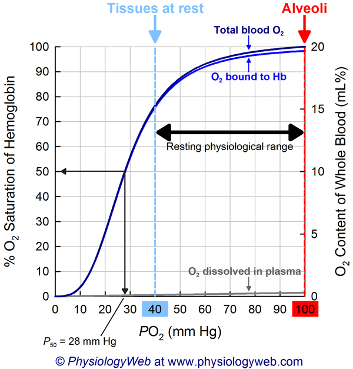
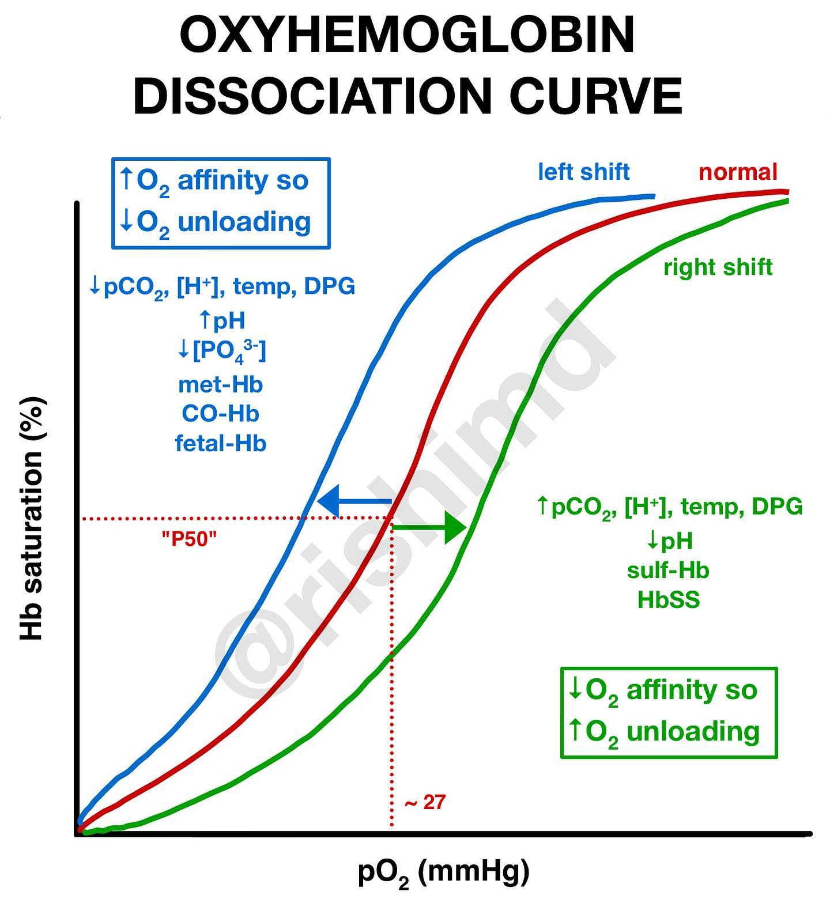

# Oxygen Dissociation Curve

The **oxygen dissociation curve** is a graph that shows the relationship between the **partial pressure of oxygen (pO₂)** and the **percentage saturation of hemoglobin with oxygen**.

### 🔍 What It Represents:

- It illustrates **how readily hemoglobin in red blood cells binds to oxygen** and how easily it releases it to tissues.
- The curve is **sigmoidal (S-shaped)** due to _cooperative binding_: when one molecule of O₂ binds to hemoglobin, it increases the affinity for the next molecules.

---

### 🩸 Key Features of the Curve:

| Part of Curve                 | Meaning                                                                                                   |
| ----------------------------- | --------------------------------------------------------------------------------------------------------- |
| **Steep slope (middle part)** | Small changes in pO₂ cause large changes in saturation — this helps oxygen be easily unloaded in tissues. |
| **Plateau (top part)**        | Hemoglobin is almost fully saturated — ensures oxygen loading in the lungs even if pO₂ drops slightly.    |

---

### 📉 Curve Shifts:

- **Right shift** (↓ affinity for O₂, more release to tissues):

  - ↑ CO₂ (Bohr effect)
  - ↑ Temperature
  - ↑ 2,3-DPG (2,3-disphosphoglycerate) [^1]
  - ↓ pH (more acidic)

- **Left shift** (↑ affinity for O₂, less release):
  - ↓ CO₂
  - ↓ Temperature
  - ↓ 2,3-BPG
  - ↑ pH (more basic)
  - Fetal hemoglobin (HbF)

---

### 🫁 Why It's Important:

- Helps match oxygen delivery to tissue needs.
- Essential in understanding conditions like anemia, altitude adaptation, and respiratory diseases.

[^1]: **2,3-Disphosphoglycerate (2,3-DPG)** is a molecule produced in red blood cells during glycolysis. It binds to deoxygenated hemoglobin, reducing its affinity for oxygen and facilitating oxygen release to tissues. Increased levels of 2,3-BPG shift the oxygen dissociation curve to the right, which is especially important under conditions like high altitude, anemia, or hypoxia.
